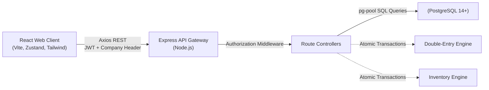
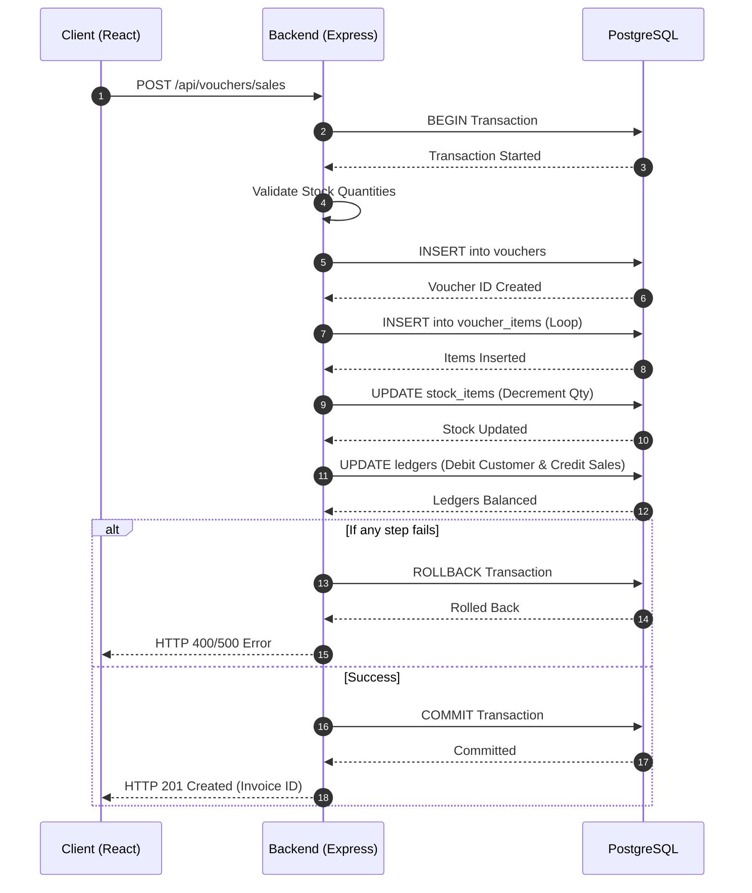
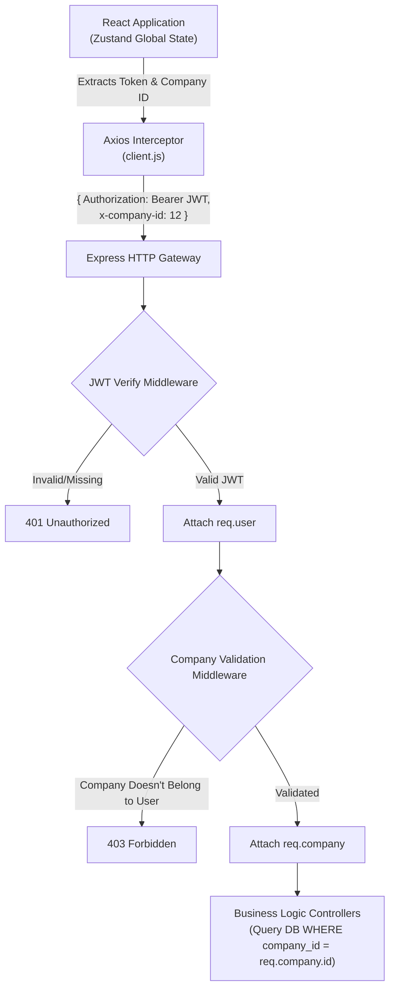
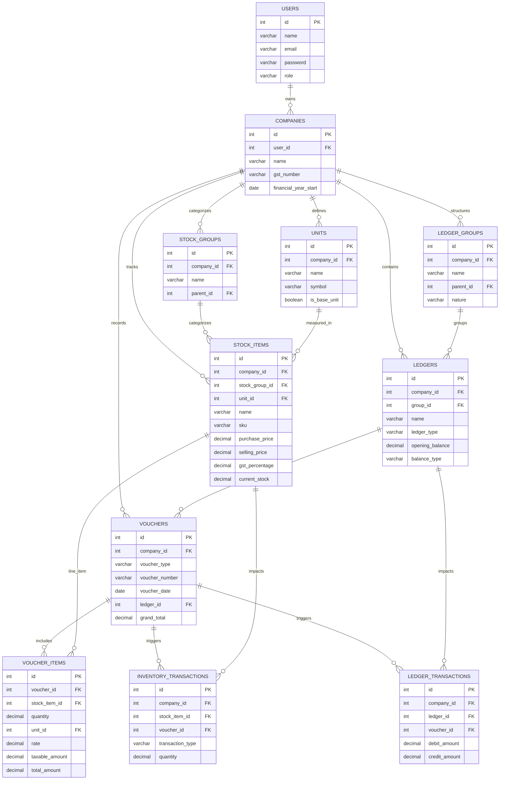
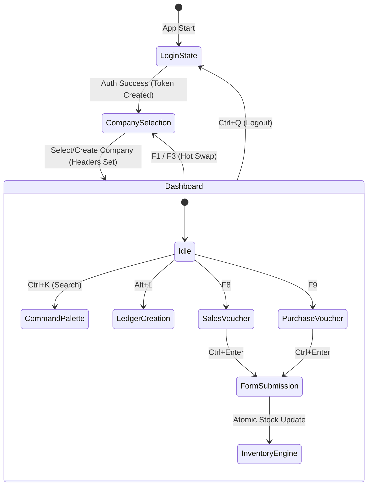
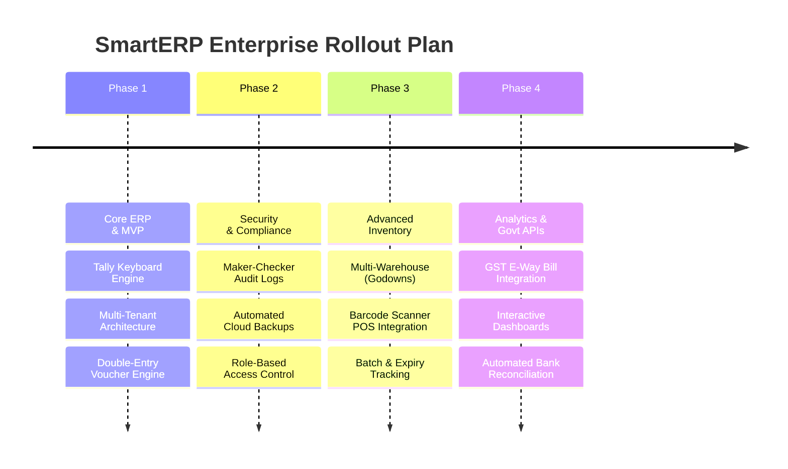

<h1 align="center">⚡ SmartERP</h1>

<p align="center">
  
</p>

<p align="center">
  <b>A Comprehensive, Lightning-Fast, Keyboard-Driven Business Accounting & Inventory Management Platform.</b><br/>
  Inspired by Tally, engineered for the modern web. Experience desktop-grade data entry velocity with cloud-native accessibility, multi-tenant isolation, and real-time ledger reconciliation.
</p>

<p align="center">
  <a href="#"></a>
  <a href="#"></a>
  <a href="#"></a>
  <a href="#"></a>
  <a href="#"></a>
</p>


## Tech Stack Used

<table align="center">
  <tr>
    <td align="center" width="130">
      <br />
      <strong>React 19</strong>
    </td>
    <td align="center" width="130">
      <br />
      <strong>Node.js</strong>
    </td>
    <td align="center" width="130">
      <br />
      <strong>Express.js</strong>
    </td>
    <td align="center" width="130">
      <br />
      <strong>PostgreSQL</strong>
    </td>
  </tr>
  <tr>
    <td align="center" width="130">
      <br />
      <strong>Tailwind CSS</strong>
    </td>
    <td align="center" width="130">
      <br />
      <strong>NPM</strong>
    </td>
    <td align="center" width="130">
      <br />
      <strong>Git</strong>
    </td>
    <td align="center" width="130">
      <br />
      <strong>Vite</strong>
    </td>
  </tr>
</table>


<br>

> ### ✨ Live Demo Access ✨
> The production database is pre-seeded with rich company data, inventory, and transactions so you can explore SmartERP immediately!
> 
> 📧 **Email:** `kudkartanmay25@gmail.com`  
> 🔑 **Password:** `123456`

<br>

## Documentation Index

- [1. Executive Summary & Vision](#1-executive-summary--vision)
- [2. Core Product Modules](#2-core-product-modules)
- [3. Architectural Deep Dive](#3-architectural-deep-dive)
- [4. Database Schema & Data Dictionary](#4-database-schema--data-dictionary)
- [5. API Reference Map](#5-api-reference-map)
- [6. Frontend Implementation Details](#6-frontend-implementation-details)
- [7. Real-World Business Workflows](#7-real-world-business-workflows)
- [8. Installation & Deployment Guide](#8-installation--deployment-guide)
- [9. Repository Layout](#9-repository-layout)
- [10. Security & Scalability](#10-security--scalability)
- [11. Future Roadmap](#11-future-roadmap)

---


## 1. Executive Summary & Vision

**SmartERP** is a production-ready Web ERP system that bridges the massive UX gap between legacy desktop accounting software (like Tally ERP 9) and modern cloud-native applications. 

Traditional web applications suffer from the "Cloud Speed Penalty"—forcing data-entry operators to continuously use their mouse, tab slowly through disjointed forms, and wait for heavy page reloads. SmartERP eradicates this by implementing a **global keyboard shortcut engine** (F8 for Sales, F9 for Purchase, Alt+L for Ledgers) directly in the browser, allowing for zero-mouse navigation. Under the hood, it is powered by an uncompromising Node.js backend and a strictly normalized PostgreSQL database, supporting true multi-tenancy where a single user can manage up to 5 completely isolated companies seamlessly.

---

## 2. Core Product Modules

### 🏭 1. Multi-Tenant Company Management
- **Row-Level Data Isolation**: Every transaction, ledger, and stock item is strictly bound to a `company_id`.
- **Instant Context Switching**: Users can hot-swap between multiple registered companies on the fly via the F1 menu, instantly updating the global Zustand state and backend HTTP interceptor contexts.

### 📚 2. Master Ledger System
- **Chart of Accounts**: Comprehensive categorization supporting Customer (Sundry Debtors), Supplier (Sundry Creditors), Cash, Bank, Direct Incomes, and Indirect Expenses.
- **Dynamic Balances**: Ledgers maintain accurate running balances, seamlessly integrating with the double-entry backend accounting logic.

### 📦 3. Real-Time Inventory Engine
- **Stock Item Catalog**: Tracks SKU, HSN/SAC codes, Cost Price, Selling Price, and dynamic GST tax brackets.
- **Unit Modeling**: Supports dynamic base units (e.g., PCS, BOX, LTR, KG) via a dedicated Units master.
- **Auto-Reconciliation**: Inventory dynamically decrements on Sales creation and increments on Purchase creation via atomic SQL transactions.

### 🧾 4. Transactional Voucher Engine
- **Sales & Purchase Vouchers**: High-velocity data entry forms supporting infinite line items.
- **Automated Tax Calculation**: Dynamically computes CGST, SGST, and IGST based on the Stock Item's defined tax brackets.
- **Printable Invoices**: Generates stunning, A4-formatted, ready-to-print GST invoices featuring automatic "Amount in Words" conversion.

---

## 3. Architectural Deep Dive

### 3.1 System Context



### 3.2 End-to-End Voucher Flow (The Atomic Transaction)

To prevent data corruption during network failures, Vouchers execute within a strict SQL `BEGIN ... COMMIT` transaction block.



### 3.3 Multi-Tenant Context Injection Architecture

To ensure strict data privacy, SmartERP utilizes a dual-barrier middleware architecture. The global Zustand state maintains the active company context and injects it into every Axios HTTP request automatically.



---

## 4. Database Schema & Data Dictionary

The database is highly normalized (3NF) to ensure absolute data integrity.

### Core Tables

| Table Name | Primary Purpose | Key Foreign Keys |
|---|---|---|
| `users` | Handles authentication and identity. | - |
| `companies` | Multi-tenant isolation boundary. | `user_id` -> users.id |
| `ledgers` | Financial accounts (Customers, Cash, etc.) | `company_id` -> companies.id |
| `units` | Measurement units (PCS, KG) | `company_id` -> companies.id |
| `stock_items` | Inventory catalog and pricing logic. | `company_id`, `unit_id` |
| `vouchers` | Transaction headers (Invoice #, Date, Total) | `company_id`, `party_ledger_id` |
| `voucher_items`| Line-item specifics (Qty, Rate, Tax) | `voucher_id`, `stock_item_id` |



---

## 5. API Reference Map

The Express API is protected by a dual-layer security middleware:
1. **JWT Verification**: Validates the `Authorization: Bearer <token>` header.
2. **Company Verification**: Ensures the `x-company-id` header belongs to the authenticated user.

### Core Endpoints

**Authentication (`/api/auth`)**
- `POST /register` - Create a new user account.
- `POST /login` - Authenticate and return JWT.

**Companies (`/api/companies`)**
- `GET /` - List all companies owned by the user.
- `POST /` - Create a new company.

**Ledgers (`/api/ledgers`)**
- `GET /` - List all ledgers for the active company.
- `POST /` - Create a new ledger.

**Inventory (`/api/stock`)**
- `GET /items` - List all stock items.
- `POST /items` - Create a new stock item.
- `GET /units` - List all units of measure.
- `POST /units` - Create a new unit.

**Vouchers (`/api/vouchers`)**
- `GET /` - Fetch voucher history (filtered by type).
- `POST /` - Create a new Sales/Purchase voucher (Transactional).
- `GET /:id` - Retrieve a specific invoice for printing.

---

## 6. Frontend Implementation Details

### 6.1 The Global Keyboard Engine (`useKeyboardShortcuts.js`)
To achieve Tally-like speed, we built a custom React Hook that attaches an event listener to the `window` object. It uses `e.preventDefault()` to bypass browser defaults and navigates the user using `react-router-dom`.

```javascript
// Global shortcut mapping
if (e.key === 'F8') { e.preventDefault(); navigate('/vouchers/sales'); }
if (e.key === 'F9') { e.preventDefault(); navigate('/vouchers/purchase'); }
if (e.altKey && e.key === 'l') { e.preventDefault(); navigate('/masters/ledger/new'); }
```

### 6.2 Zustand State Management
Zustand manages the session globally without the boilerplate of Redux.
- **`useStore`**: Stores the `user`, `token`, and the currently selected `activeCompany`.
- If the `token` exists but `activeCompany` is null, the user is forced into the Company Selection screen, ensuring no API calls are made without a strict multi-tenant boundary.

### 6.3 Axios Interceptors (`client.js`)
Axios automatically injects the necessary security headers into every outgoing request:
```javascript
api.interceptors.request.use((config) => {
  const token = localStorage.getItem('token');
  const companyId = localStorage.getItem('activeCompanyId');
  if (token) config.headers['Authorization'] = `Bearer ${token}`;
  if (companyId) config.headers['x-company-id'] = companyId;
  return config;
});
```

### 6.4 Comprehensive Keyboard Mapping & State Flow

SmartERP implements a rigid, conflict-free global shortcut system. It intelligently blocks specific shortcuts when typing inside form inputs to prevent accidental triggers, while still allowing critical form overrides (like `Ctrl+Enter` to submit forms) globally.

#### Global State & Navigation Flow



#### ⌨️ Detailed Shortcut Matrix

| Category | Shortcut | Action / Target | Context Availability |
|---|---|---|---|
| 🌍 **Global Controls** | <kbd>Ctrl</kbd> + <kbd>Q</kbd> | 🚪 Logout and clear session | Everywhere |
| | <kbd>Ctrl</kbd> + <kbd>K</kbd> | 🔍 Open Global Command/Search Palette | Everywhere (except inputs) |
| | <kbd>F1</kbd> / <kbd>F3</kbd> | 🏢 Open Company Selection | Everywhere |
| | <kbd>F2</kbd> | 📅 Toggle Financial Year Modal | Everywhere |
| | <kbd>F4</kbd> | 🧮 Toggle Smart Calculator | Everywhere |
| | <kbd>Ctrl</kbd> + <kbd>H</kbd> | 🏠 Go to Dashboard/Home | Everywhere |
| | <kbd>Esc</kbd> | ❌ Close Modals or Go Back | Everywhere |
| ⚡ **Forms & Actions**| <kbd>Ctrl</kbd> + <kbd>Enter</kbd> | ✅ Submit the active form | **Inside & Outside Inputs** |
| | <kbd>Alt</kbd> + <kbd>C</kbd> | 🚫 Cancel current form / Go Back | **Inside & Outside Inputs** |
| | <kbd>Enter</kbd> | 🖱️ Trigger focused action/button | Data Tables / Action Rows |
| | <kbd>Ctrl</kbd> + <kbd>E</kbd> | ✏️ Edit the highlighted table row | Data Tables |
| | <kbd>Ctrl</kbd> + <kbd>D</kbd> | 🗑️ Delete the highlighted table row | Data Tables |
| 🧾 **Voucher Entry** | <kbd>F8</kbd> | 💰 Create New Sales Voucher | Everywhere (except inputs) |
| | <kbd>F9</kbd> | 🛒 Create New Purchase Voucher | Everywhere (except inputs) |
| | <kbd>Ctrl</kbd> + <kbd>B</kbd> | ⚡ Quick Billing (Sales Voucher) | Everywhere (except inputs) |
| | <kbd>Ctrl</kbd> + <kbd>P</kbd> | 🖨️ Print current invoice | Invoice Views |
| | <kbd>Ctrl</kbd> + <kbd>M</kbd> | 📧 Email current invoice | Invoice Views |
| 📚 **Master Routing** | <kbd>Alt</kbd> + <kbd>L</kbd> | 📘 Create New Ledger | Everywhere (except inputs) |
| | <kbd>Alt</kbd> + <kbd>A</kbd> | 📖 View All Ledgers | Everywhere (except inputs) |
| | <kbd>Alt</kbd> + <kbd>S</kbd> | 📦 Create New Stock Item | Everywhere (except inputs) |
| | <kbd>Alt</kbd> + <kbd>U</kbd> | ⚖️ Open Unit Master Form | Everywhere (except inputs) |
| | <kbd>Ctrl</kbd> + <kbd>I</kbd> | 📊 Open Inventory Item List | Everywhere (except inputs) |

---

## 7. Real-World Business Workflows

**The Standard Wholesale Workflow:**
1. **Initialize**: The owner logs in and creates a Company (e.g., "Tech Distributors Pvt Ltd").
2. **Master Creation**: They hit `Alt+U` to create "PCS", `Alt+S` to add "Wireless Mouse", and `Alt+L` to add a supplier "Logitech Corp".
3. **Purchasing**: They press `F9` (Purchase Voucher), select "Logitech Corp", enter 500 PCS of "Wireless Mouse". **Result:** Inventory instantly updates to 500 PCS.
4. **Selling**: A retail client arrives. The owner presses `F8` (Sales Voucher), selects the client, and sells 50 PCS. **Result:** Inventory drops to 450 PCS, CGST/SGST is calculated automatically.
5. **Invoicing**: The owner clicks "Print", generating an A4 PDF invoice directly from the browser to hand to the retail client.

---

## 🚀 8. Installation & Deployment Guide

### 🛠️ 8.1 Local Development Prerequisites

Before you begin, ensure you have the following installed on your machine:
- **Node.js** (v18.0.0 or higher) 🟢
- **PostgreSQL** (v14 or higher, running on port `5432`) 🐘

### 🗄️ 8.2 Database Initialization

First, create the empty database where SmartERP will store its data.

```bash
# Log into your local PostgreSQL CLI
psql -U postgres

# Create the empty database
CREATE DATABASE smarterp;
```

> [!TIP]
> **Auto-Migration Magic ✨:** You do NOT need to run any SQL scripts manually! SmartERP utilizes an auto-migration script (`schema.js`) that automatically generates all 11 tables the very first time you boot up the backend.

### ⚙️ 8.3 Backend Setup

Open a terminal and navigate to the backend directory to install dependencies.

```bash
cd backend
npm install
```

> [!IMPORTANT]
> Create a `.env` file in the `/backend` directory and add the following keys. Make sure the database credentials match your local PostgreSQL setup!

```env
# Backend Server Port
PORT=5000

# PostgreSQL Configuration
DB_HOST=localhost
DB_PORT=5432
DB_NAME=smarterp
DB_USER=postgres
DB_PASSWORD=your_postgres_password

# Authentication Secrets
JWT_SECRET=your_super_secret_key_here
JWT_EXPIRE=7d
```

Finally, start the backend development server:
```bash
npm run dev
```

### 🖥️ 8.4 Frontend Setup

Open a **new** terminal window (keep the backend running) and navigate to the frontend directory.

```bash
cd frontend
npm install
```

> [!NOTE]
> Create a `.env` file in the `/frontend` directory to link the React app to your Express backend API.

```env
# Points the Vite proxy to your backend API
VITE_API_URL=http://localhost:5000/api
```

Start the React (Vite) development server:
```bash
npm run dev
```

> [!SUCCESS]
> **You're all set! 🎉** Open `http://localhost:5173` in your browser and start managing your business!

---

## 9. Repository Layout

SmartERP utilizes a clean monorepo architecture, cleanly separating the Express Backend from the React Frontend. Below is the exhaustive file map detailing the explicit usage of every component:

### ⚙️ Backend API (`/backend`)
```text
backend/
├── 📄 package.json          # Node dependencies (express, pg, bcrypt, jsonwebtoken)
└── 📂 src/
    ├── 🚀 index.js          # Core Express server, CORS config, and API route mounting
    ├── 📂 db/               # PostgreSQL Database Layer
    │   ├── 🔌 pool.js       # Manages the PG connection pool for scalable concurrent queries
    │   ├── 🏗️ schema.js     # Auto-migration script that creates all 11 ERP database tables
    │   ├── 🌱 seed.js       # Small utility script for seeding test data
    │   └── 📚 full_seed.sql # Master SQL dump containing comprehensive initial test data
    ├── 📂 middleware/       # Security & Interceptors
    │   └── 🛡️ auth.js       # JWT validation & x-company-id validation to ensure Multi-Tenancy
    └── 📂 routes/           # REST Controllers & API Endpoints
        ├── 🔑 auth.js       # Handles /register and /login endpoints (bcrypt hashing)
        ├── 🏢 companies.js  # Handles company creation and fetching for the active user
        ├── 📘 ledgers.js    # Financial accounts logic (Debtors, Creditors, Bank, Cash)
        ├── 📦 stock.js      # Inventory management (Stock Items, Units of Measure)
        └── 🧾 vouchers.js   # The complex Double-Entry Voucher Engine (Sales, Purchases)
```

### 🖥️ Frontend Client (`/frontend`)
```text
frontend/
├── 📄 package.json          # React dependencies (vite, zustand, tailwindcss, react-hook-form)
├── ⚙️ vite.config.js        # Vite bundler configuration & local API proxying
└── 📂 src/
    ├── 🚀 main.jsx          # React DOM entry point mapping <App /> to the root div
    ├── 🗺️ App.jsx           # Global React Router DOM definition & Protected Routes
    ├── 🎨 index.css         # Massive global stylesheet containing custom Tailwind utilities & CSS variables
    ├── 🎨 App.css           # Secondary stylesheet for localized App wrapper styling
    ├── 📂 api/              # Axios HTTP Layer
    │   └── 🌐 client.js     # Global Axios instance that automatically injects JWTs and Company IDs
    ├── 📂 store/            # Global State Management
    │   └── 🧠 useStore.js   # Zustand store managing Active User, Token, and Active Company
    ├── 📂 hooks/            # Custom React Hooks
    │   ├── ⌨️ useKeyboardShortcuts.js # The massive engine mapping F8, F9, Alt+L to navigation
    │   ├── 🧭 useSpatialNavigation.js # Handles Arrow Key navigation across data tables
    │   └── 🩺 useServerHealth.js      # Pings the backend to check if the Render instance is awake
    ├── 📂 components/       # Reusable UI Elements
    │   ├── 🖼️ AppLayout.jsx           # The primary Dashboard Wrapper containing the Sidebar & Header
    │   ├── 🔐 AuthLayout.jsx          # The minimalist wrapper for Login & Registration screens
    │   ├── ⏳ GlobalLoader.jsx & css  # A beautiful full-screen loading spinner
    │   ├── 🔽 CustomSelect.jsx        # A styled, keyboard-accessible dropdown component
    │   ├── 📅 YearSelectInput.jsx     # Financial Year selection component
    │   └── 🌟 NeonSweepButton.jsx     # A custom UI button with a sweeping hover animation
    └── 📂 pages/            # Primary View Controllers
        ├── 🏠 Landing.jsx & css       # The beautiful, public-facing marketing homepage
        ├── 🔑 Login.jsx               # User authentication view
        ├── 📝 Register.jsx            # User registration view
        ├── 🏢 CompanySelection.jsx    # The gatekeeper screen forcing users to pick an active company
        ├── 📊 Dashboard.jsx           # The main financial overview (Charts & Quick stats)
        ├── 📈 Reports.jsx             # Dedicated view for generating accounting & stock reports
        ├── ⌨️ ShortcutsGuide.jsx      # A visual cheat-sheet of all available Tally keyboard shortcuts
        ├── 💤 ServerWaking.jsx & css  # Polling screen shown when the Render server is waking up
        ├── 📂 masters/                # Master Data Creation Views
        │   ├── 📘 LedgerForm.jsx      # Form to create Customers, Suppliers, Incomes, etc.
        │   ├── 📚 LedgerList.jsx      # Data table displaying all created ledgers
        │   ├── 📦 StockItemForm.jsx   # Form to create inventory items (with GST% & Pricing)
        │   ├── 📦 StockItemList.jsx   # Data table displaying current stock levels
        │   └── ⚖️ UnitList.jsx        # View & Creation modal for Units of Measure (PCS, KG)
        └── 📂 vouchers/               # Transaction Data Entry Views
            ├── 🧾 VoucherForm.jsx     # The massive, infinite-row Sales & Purchase entry grid
            ├── 📋 VoucherList.jsx     # Historical log of all recorded transactions
            └── 🖨️ InvoiceView.jsx     # The A4-formatted, ready-to-print GST PDF generator view
```

---

## 10. Security & Scalability

SmartERP is built with enterprise security principles to ensure data remains strictly confidential and infrastructure remains resilient under load.

### 🛡️ Security Posture
- **Password Hashing**: All user passwords are cryptographically salted and hashed using `bcrypt` (10 rounds) before hitting the database. Plain text passwords are never stored or logged.
- **Stateless Authentication**: We utilize JSON Web Tokens (JWT) with secure expiration policies (`7d`) rather than stateful sessions, drastically reducing backend memory overhead.
- **Hardened Middleware Boundary**: Every protected route runs through a proprietary `protect` middleware that parses the Bearer token, validates signature integrity, and attaches the `req.user` object securely.
- **Strict Multi-Tenancy**: The custom `x-company-id` header validation completely eliminates IDOR (Insecure Direct Object Reference) vulnerabilities, preventing malicious actors from querying financial ledgers belonging to other companies.

### 🚀 Scalability Design
- **PostgreSQL Connection Pooling**: The backend uses the `pg` library's connection pool, efficiently multiplexing incoming concurrent requests across a limited number of database connections rather than crashing under high traffic.
- **Vite Build Optimization**: Production frontend builds are automatically tree-shaken, minified, and heavily chunked by Vite/Rollup to ensure the fastest possible First Contentful Paint (FCP) on slow networks.

---

## 11. Future Roadmap

While the core ledger and voucher systems are extremely robust, we are actively expanding SmartERP to become an all-in-one enterprise financial ecosystem.

### 🗺️ Development Timeline



### 🔒 1. Enterprise Security & Compliance
- [ ] **Maker-Checker Audit Logs 🕵️‍♂️**: Track exactly which user created, edited, or deleted a voucher to prevent fraud. Implement workflows where a junior clerk creates an entry (Maker) but it only affects the books when a manager approves it (Checker).
- [ ] **Automated Cloud Backups ☁️**: Allow business owners to generate one-click encrypted `.sql` data dumps, or automatically sync daily backups to Google Drive/AWS S3.
- [ ] **Role-Based Access Control (RBAC) 🛡️**: Invite sub-users (e.g., Accountants, Data Entry Clerks) with granular permissions restricting access to specific companies or voucher types.

### 📦 2. Advanced Inventory & POS
- [ ] **Multi-Warehouse (Godown) Management 🏭**: Track stock not just by company, but by different physical branch locations or warehouses.
- [ ] **Barcode Scanner Integration 📇**: Add a dedicated POS (Point of Sale) view that listens for rapid barcode scanner inputs to instantly add items to the Sales Voucher without touching the keyboard.
- [ ] **Batch & Expiry Tracking ⏳**: Crucial for pharmacies or FMCG businesses to track which specific batch of a product is being sold to prevent selling expired goods.

### 📊 3. Analytics & Integrations
- [ ] **Data Visualization Dashboard 📈**: Integrate `Recharts` or `Chart.js` to show beautiful graphical analytics of Monthly Cashflow, Top 5 Selling Products, and Expense breakdowns.
- [ ] **Direct GST Portal Integration 🏛️**: Connect directly to government APIs to automatically push GSTR-1 data or generate E-Way bills directly from the invoice view.
- [ ] **Automated Bank Reconciliation 🏦**: Reconcile ledger statements directly with uploaded bank OFX/CSV files to ensure cash-at-bank matches the internal ledgers.
